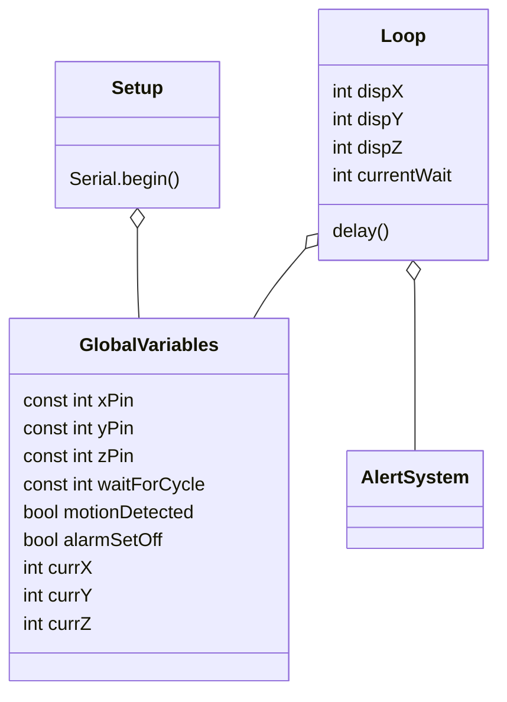
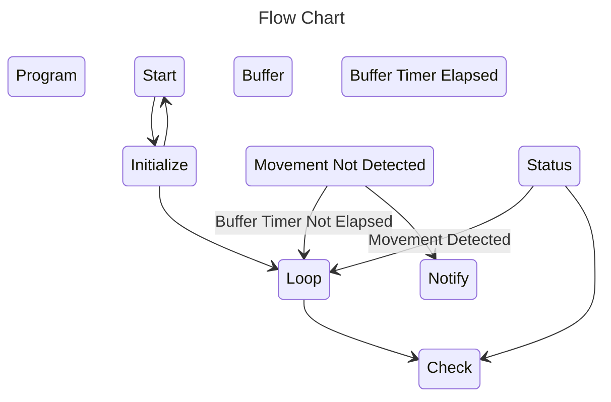

#  UML Class Diagram

```mermaid
classDiagram

    class Setup {
        Serial.begin()
}

    class Loop {
        int dispX
        int dispY
        int dispZ
        int currentWait
        delay()

}

    class GlobalVariables {
        const int xPin
        const int yPin
        const int zPin
        const int waitForCycle
        bool motionDetected
        bool alarmSetOff
        int currX
        int currY
        int currZ
}

    class AlertSystem {
        
}

    Loop o-- AlertSystem
    Loop o-- GlobalVariables
    Setup o-- GlobalVariables
```

# Flow Chart

```mermaid
---
title: Flow Chart
---
stateDiagram-v2
    Program Start --> Initialize
    Initialize --> Start Buffer Timer
    Initialize --> Loop
    Loop --> Check Status
    Check Status --> Loop : Movement Detected
    Check Status --> Check Timer : Movement Not Detected
    
    Check Timer --> Loop : Buffer Timer Not Elapsed
    Check Timer --> Notify User : Buffer Timer Elapsed
    
```
