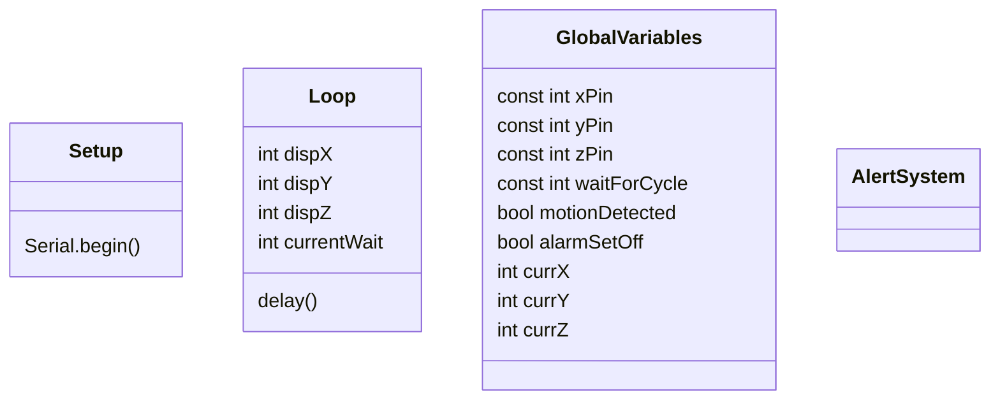

#  UML Class Diagram

```mermaid
classDiagram

    class Setup {
        Serial.begin()
}

    class Loop {
        int dispX
        int dispY
        int dispZ
        int currentWait
        delay()

}

    class GlobalVariables {
        const int xPin
        const int yPin
        const int zPin
        const int waitForCycle
        bool motionDetected
        bool alarmSetOff
        int currX
        int currY
        int currZ
}

    class AlertSystem {
        
}
```
