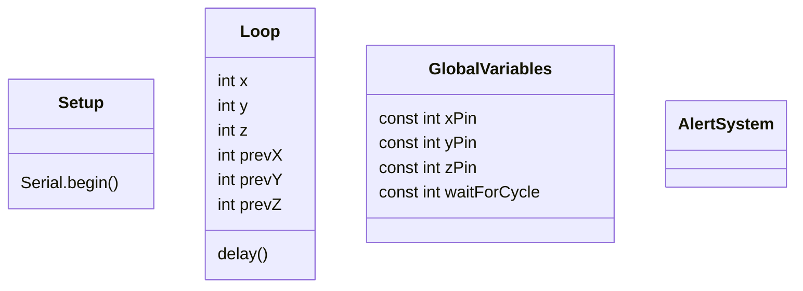

#  UML Class Diagram

```mermaid
classDiagram

    class Setup {
        Serial.begin()
}

    class Loop {
        int x
        int y
        int z
        
        int prevX
        int prevY
        int prevZ

        delay()

}

    class GlobalVariables {
        const int xPin
        const int yPin
        const int zPin
        const int waitForCycle
}

    class AlertSystem {
        
}
```
